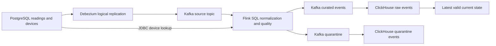

# Architecture and delivery contracts

The source uses one partition, positive BIGINT identities, DOUBLE PRECISION temperatures in Celsius, and `REPLICA IDENTITY FULL`. Snapshot (`r`), create (`c`), update (`u`), and delete (`d`) retain their operation. Kafka null tombstones carry no new row mutation; the preceding delete envelope invalidates the row.

Logical identity is `lab:public:readings:<lsn>:<op>:<id>`. The WAL sequence orders row versions. Raw storage intentionally retains physical duplicates; current state selects the maximum version with a deterministic tie-breaker. A newer invalid mutation invalidates the prior visible value and also appears in quarantine. Repairing the source produces a newer valid version.

Debezium may redeliver after connector failure. Flink checkpoints source positions; the Kafka sink explicitly uses at-least-once delivery. ClickHouse consumes through its Kafka engine/materialized views and can redeliver around offset commits. Consequently, the system claims duplicate-tolerant current-state convergence, not end-to-end exactly-once delivery. Event counts must use logical identity; raw `count()` measures physical deliveries.

Device enrichment uses processing-time JDBC lookup with no lookup cache. Devices are reference data held stable during a run. A later device-site edit does not retroactively update prior readings; replaying source history against a changed dimension can change enrichment. Freeze/reference-version the dimension before cross-run equivalence comparisons. The raw source topic is retained rather than compacted to preserve delete envelopes for replay.
